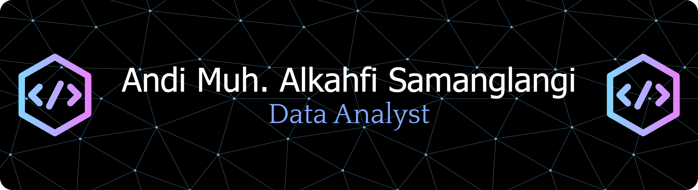

# **HELLO WORLD!!!⚡⚡⚡**

## **About Me✨**
Detail-oriented Data Analyst with strong expertise in data analysis, business intelligence, and machine learning, gained through hands-on projects and professional internships. Skilled in Python, SQL, Excel, Tableau, Power BI, and Looker Studio, with the ability to transform raw datasets into actionable business insights. Experienced in dashboard development, data engineering, and predictive modeling to support data-driven decision-making. Background in the power plant industry has built solid skills in problem solving, process optimization, and cross-functional collaboration, and is ready to contribute analytical and technical expertise to support organizational growth.

##  **Skills** 🛠️

  
  
  
  
  
  
  

##  **Connect with Me** 

## **Experience**
### 📍 PT Erajaya Swasembada — *West Jakarta, Indonesia*  
**Data Analyst and Monitoring**
- Apr 2026 - Now

**Data Analyst and Monitoring Intern**
- Oct 2025 - Apr 2026

### 📍 PT Stargate Pasific Resources — *South Jakarta, Indonesia*  
**Data Analyst Intern**
- Jan 2025 - Apr 2025

### 📍 PT Indonesian Tsingshan Stainless Steel — *Central Sulawesi, Indonesia*  
**Power Plant Control Room Assistant Operator**
- Jan 2022 - Aug 2024

**Power Plant Control Room Operator Intern**
- Feb 2020 - Feb 2021

---

## **Education**
### 📍 Politeknik Industri Logam Morowali — *Morowali, Indonesia*  
**Diploma in Electrical Engineering**  
- GPA: **3.33**  
- Aug 2018 – Oct 2021  

---

### 📍 Universitas Muslim Indonesia — *Makassar, Indonesia*  
**Bachelor’s in Electrical Engineering**  
- GPA: **3.47**  
- Aug 2022 – Feb 2025  

---

### 📍 Purwadhika Digital Technology School — *Jakarta, Indonesia*  
**Data Science & Machine Learning Program**  
- Aug 2022 – Feb 2025  

## **Certifications**📜 

- 🎓 **Purwadhika Digital Technology School**  
  Job Connector Bootcamp Data Science 
  [🔗 Certification Link](https://drive.google.com/file/d/1Laymu2TNLXuzzAn220MFniGzI-XNtuXU/view?pli=1)  
  (Issued Feb 2025)  

- 🐍 **Udemy**  
  The Complete SQL Bootcamp: Go From Zero to Hero  
  [🔗 Certification Link](https://www.udemy.com/certificate/UC-3f896e7e-aefa-4947-8ae0-a2f78b1ced92/)  
  (Issued Apr 2025)  

- 📊 **Udemy**  
  Microsoft Excel: Learn Modern Excel for Data Analysis (2025)  
  [🔗 Certification Link](https://www.udemy.com/certificate/UC-ced25fe4-0f8f-48ea-b8ec-d916c701b6ba/)  
  (Issued May 2025)  

- 💻 **HackerRank**  
  SQL (Intermediate)  
  [🔗 Certification Link](https://www.hackerrank.com/certificates/108479287af4)  
  (Issued Jul 2025)  

- 📈 **DataCamp**  
  Associate Data Analyst  
  [🔗 Certification Link](https://www.datacamp.com/certificate/DAA0011426282551)  
  (Issued Jul 2025)  

## **Projects**  

I have worked on several projects related to **Data Analysis, Data Science, and Machine Learning**.  
To explore them in detail, please visit my **GitHub repositories** on my profile.  

💡 *Check out my repositories to see more of my work!*  

<picture>
  <source media="(prefers-color-scheme: dark)" srcset="https://raw.githubusercontent.com/andikahfi98/andikahfi98/output/pacman-contribution-graph-dark.svg">
  <source media="(prefers-color-scheme: light)" srcset="https://raw.githubusercontent.com/andikahfi98/andikahfi98/output/pacman-contribution-graph.svg">
  
</picture>
